<div align="center">




</div>

---

### 🛡️ root@criscoser:~# nmap -sV -p- localhost --skills

```diff
⚡ SCAN REPORT FOR CRISCOSER
[+] Host is up.

PORT      SERVICE          STACK
22/tcp    ssh              Linux Terminal Flow 🐧
80/tcp    http             Django & Flask 🦊
443/tcp   https            Secure Web Protocols 🔒
5555/tcp  firmware         Embedded Systems / Mechatronics ⚙️
9001/tcp  reverse-shell    Python Automation 🐍

--- CORE LANGUAGES ---
+ Python .... Core / Automation / Exploit Dev
+ C ......... Memory Management / Low-Level
+ C++ ....... Reverse Engineering
+ Rust ...... Memory Safety
```

<div align="center">


</div>

---

### 📊 root@criscoser:~# htop --stats

<div align="center">


</div>

---

### 🔑 root@criscoser:~# motivation --read

> "I am an eternal learner." 🧠


